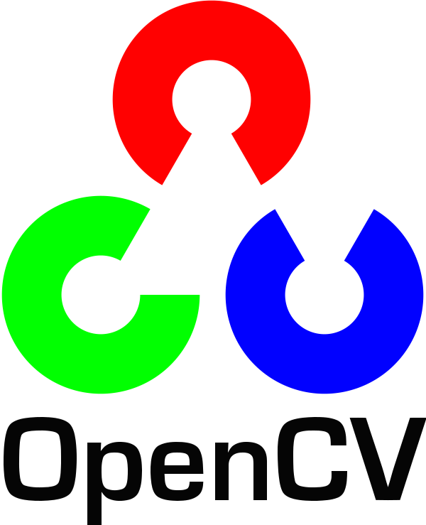

# Vision
This repository will host implementation computer vision algorithms applying the [Neodroid](https://github
.com/sintefneodroid/) platform.

---

_[Neodroid](https://github.com/sintefneodroid) is developed with support from Research Council of Norway Grant #262900. ([https://www.forskningsradet.no/prosjektbanken/#/project/NFR/262900](https://www.forskningsradet.no/prosjektbanken/#/project/NFR/262900))_

---

| [](https://travis-ci.org/sintefneodroid/agent)  | [](https://coveralls.io/github/sintefneodroid/agent?branch=master)  | [](https://github.com/sintefneodroid/agent/issues)  |  [](https://github.com/sintefneodroid/agent/network) | [](https://github.com/sintefneodroid/agent/stargazers) |[](https://github.com/sintefneodroid/agent/blob/master/LICENSE.md) |
|---|---|---|---|---|---|

<p align="center" width="100%">
  <a href="https://www.python.org/">
    
  </a>
  <a href="https://opencv.org/" style="float:center;">
    
  </a>
  <a href="http://pytorch.org/"style="float: right;">
    
  </a>
</p>
<p align="center" width="100%">
  <a href="http://www.numpy.org/">
    
  </a>
  <a href="https://github.com/tqdm/tqdm" style="float:center;">
    
  </a>
  <a href="https://matplotlib.org/" style="float: right;">
    
  </a>
</p>

# Contents Of This Readme
- [Algorithms](#algorithms)
- [Requirements](#requirements)
- [Usage](#usage)
- [Results](#results)
  - [Target Point Estimator](#target-point-estimator)
- [Contributing](#contributing)
- [Other Components](#other-components-of-the-neodroid-platform)

# Algorithms
- [REINFORCE (PG)](agents/pg_agent.py)
- [DQN](agents/dqn_agent.py)

# Requirements
- pytorch
- tqdm
- Pillow
- numpy
- matplotlib
- torchvision
- torch
- Neodroid
- pynput

To install these use the command:
````bash
pip3 install -r requirements.txt
````

# Usage
Export python path to the repo root so we can use the utilities module
````bash
export PYTHONPATH=/path-to-repo/
````
For training a agent use:
````bash
python3 procedures/train_agent.py
````
For testing a trained agent use:
````bash
python3 procedures/test_agent.py
````

# Results

## Target Point Estimator
Using Depth, Segmentation And RGB images to estimate the location of target point in an environment.

### [REINFORCE (PG)](agents/pg_agent.py)

### [DQN](agents/dqn_agent.py)


# Contributing
See guidelines for contributing [here](CONTRIBUTING.md).

# Citation

For citation you may use the following bibtex entry:

````
@misc{neodroid-agent,
  author = {Heider, Christian},
  title = {Neodroid Vision},
  year = {2019},
  publisher = {GitHub},
  journal = {GitHub repository},
  howpublished = {\url{https://github.com/sintefneodroid/Vision}},
}
````
