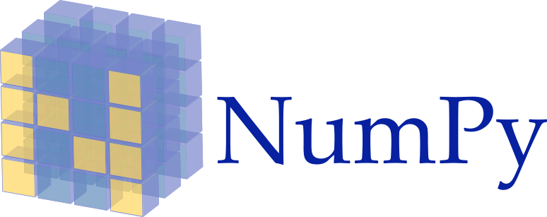
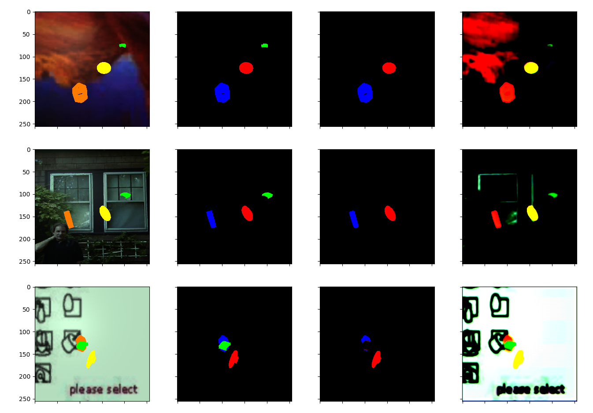

<!---->

<p align="center">
  
</p>

<h1 align="center">Vision</h1>

<!--# Vision-->


This repository will host implementations of computer vision algorithms, this repository hosts a general toolbox in
library format under [neodroidvision](neodroidvision), while also comprising a range of sample usages in
[samples](samples), many of them utilising the
[Neodroid](https://github.com/sintefneodroid/) platform.

---

_[Neodroid](https://github.com/sintefneodroid) is developed with support from Research Council of Norway Grant

# 262900. ([https://www.forskningsradet.no/prosjektbanken/#/project/NFR/262900](https://www.forskningsradet.no/prosjektbanken/#/project/NFR/262900))_

---

| [](https://travis-ci.org/aivclab/vision)  | [](https://coveralls.io/github/aivclab/vision?branch=master)  | [](https://github.com/aivclab/vision/issues)  |  [](https://github.com/aivclab/vision/network) | [](https://github.com/aivclab/vision/stargazers) |[](https://github.com/aivclab/vision/blob/master/LICENSE.md) |
|---|---|---|---|---|---|

<p align="center" width="100%">
  <a href="https://www.python.org/">
    
  </a>
  <a href="http://pytorch.org/" style="float: right;">
    
  </a>
</p>
<p align="center" width="100%">
  <a href="http://www.numpy.org/">
    
  </a>
  <a href="https://github.com/tqdm/tqdm" style="float:center;">
    
  </a>
</p>

# Contents Of This Readme

- [Algorithms](#algorithms)
- [Requirements](#requirements)
- [Usage](#usage)
- [Results](#results)
    - [Segmentation](#segmentation)
- [Contributing](#contributing)
- [Other Components](#other-components-of-the-neodroid-platform)

# Computer Vision Algorithms

### Classification
-

### Segmentation

- [UNET](neodroidvision/segmentation/instance_segmentation_model.py) - Segmentation model
- [AUX-UNET](neodroidvision/multitask/fission/skip_hourglass/skip_hourglass_fission.py) - Instance Segmentation model +
  Auxilary ouputs

### Detection

- [SSD](neodroidvision/detection/single_stage/ssd) - Object Detection Model
- [MASK-RCNN](neodroidvision/detection/two_stage/mask_rcnn) - Object Detection Model

### Regression

#### Generative

- [SAGAN](neodroidvision/regression/generative) - Generative model
- [VAE](neodroidvision/regression/vae) - Generative model

# Requirements

- pytorch
- tqdm
- Pillow
- numpy
- matplotlib
- torchvision
- torch
- Neodroid
- pynput

To install these use the command:

````bash
pip3 install -r requirements.txt
````

# Usage

Export python path to the repo root so we can use the utilities module

````bash
export PYTHONPATH=/path-to-repo/
````

For training a agent use:

````bash
python3 procedures/train_agent.py
````

For testing a trained agent use:

````bash
python3 procedures/test_agent.py
````

# Results

## Segmentation

[Code](samples/regression/segmentation/run.py)

### Screenshots



# Contributing

See guidelines for contributing [here](CONTRIBUTING.md).

# Citation

For citation you may use the following bibtex entry:

````
@misc{neodroid-vision,
  author = {Heider, Christian},
  title = {Neodroid Vision},
  year = {2019},
  publisher = {GitHub},
  journal = {GitHub repository},
  howpublished = {\url{https://github.com/aivclab/vision}},
}
````

# Authors

* **Christian Heider Nielsen** - [cnheider](https://github.com/cnheider)
* [Other contributors](https://github.com/aivclab/vision/contributors)
